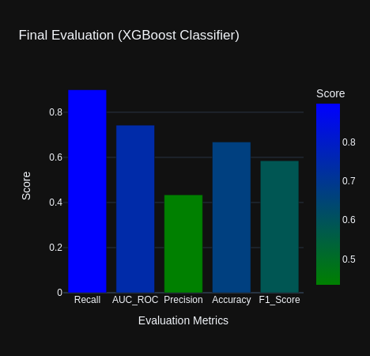

# **Customer Churn Prediction**

### A Project as an ML Intern given by ***[Innobytes Services](https://www.linkedin.com/company/innobyte-services/posts/?feedView=all)***

A Classification model that predicts whether a customer will churn or not.

<center>

**Open Notebook 🔥**


[](./Customer_Churn_Prediction.ipynb) &nbsp; &nbsp;
[](https://nbviewer.org/github/DarkDk123/Customer-churn-prediction-innobytes/blob/main/Customer_Churn_Prediction.ipynb) &nbsp; &nbsp;
[](https://colab.research.google.com/github/DarkDk123/Customer-churn-prediction-innobytes/blob/main/Customer_Churn_Prediction.ipynb)


</center>

## Predicting Customer Churn using Machine Learning

<center>  </center><br><br>

This project builds a machine learning model capable of predicting whether a customer will **churn (leave)** based on their characteristics. The data comes from a *Telco customer churn* dataset.

### **1. Problem Definition**
>Understanding how customer attributes contribute  the probability of their churn, insights & patterns etc.

> How accurately can we predict customer churn based on customer attributes like usage behavior, contract type, and services used?

### **2. Data**
The dataset is sourced from Telco's customer churn records and includes the following features:

- Customer demographics (gender, senior citizen status)
- Services used (internet, phone, etc.)
- Contract types (month-to-month, one year, two years)
- Billing information (monthly and total charges)

I have used the specific dataset provided in the Internship. For more details explore below sources.

**Official Sources :** [Kaggle](https://www.kaggle.com/blastchar/telco-customer-churn) & [IBM](https://community.ibm.com/community/user/businessanalytics/blogs/steven-macko/2019/07/11/telco-customer-churn-1113)

### **3. Evaluation**

We evaluate the model using classification metrics such as accuracy, F1-score, precision, recall, and ROC-AUC. The primary goal is to minimize misclassification errors, **particularly false negatives**.

Also our prime focus was to maximize the **tradeoff** between **Recall & AUC Score.**

### **4. Features**

The dataset contains customer data with various service attributes. Key features include contract type, paperless billing, payment method, monthly charges, and tenure.

After **model driven EDA**, we understand the following features are crucial to predict Customer Churn!


### **5. Key Achievements**

1. **Data Preprocessing Pipeline**:
   - Developed a robust preprocessing pipeline for cleaning and encoding features.
   - Efficiently handled missing data and categorical variables.

2. **Machine Learning Model Development**:
   - Built multiple classifiers: Logistic Regression, Decision Trees, Random Forest, XGBoost, LightGBM, and CatBoost.
   - Applied cross-validation for model evaluation.

3. **Hyperparameter Tuning**:
   - Used Bayesian optimization with `BayesSearchCV` to improve model performance by fine-tuning hyperparameters.

### **Final Result**

The final model achieved a **recall** of ***90%*** & **AUC score** of ***75%*** , successfully predicting customer churn with good accuracy.


<br>

**Confusion Matrix & ROC Curve for predictions!**


### For more details, refer to the Jupyter [Notebook](./Customer_Churn_Prediction.ipynb) file.

---

#### Run the model locally!

1. ```python
   pip install -r requirements_to_run.txt # install requirements!
   ```

2. ```python
   streamlit run Streamlit_front/main_streamlit.py # From root directory
   ```
3. Open the server in your browser: http://127.0.0.1:8501/

4. Get predictions for you customer either with the *form* or *upload a CSV file.*

**Other images :**

|Input data format|Uploading CSV File|
|---|---|
|||

---

#### Author: [Dipesh Rathore](https://github.com/DarkDk123) 😎
#### Complete Analysis : [Notebook](./Customer_Churn_Prediction.ipynb)

---